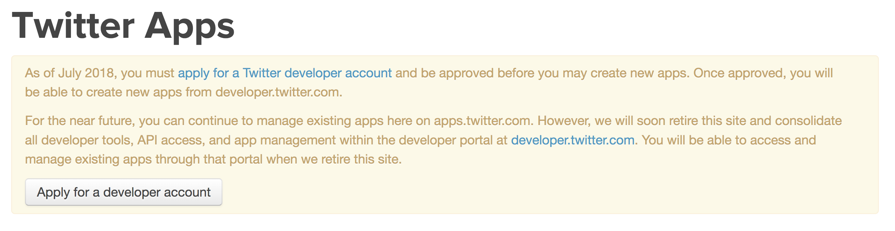
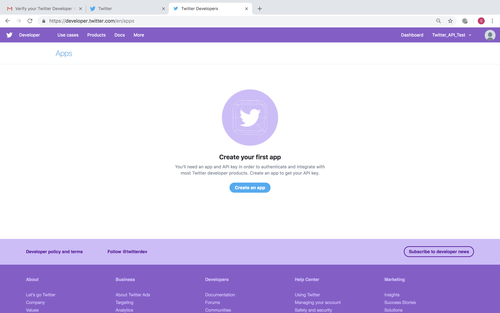
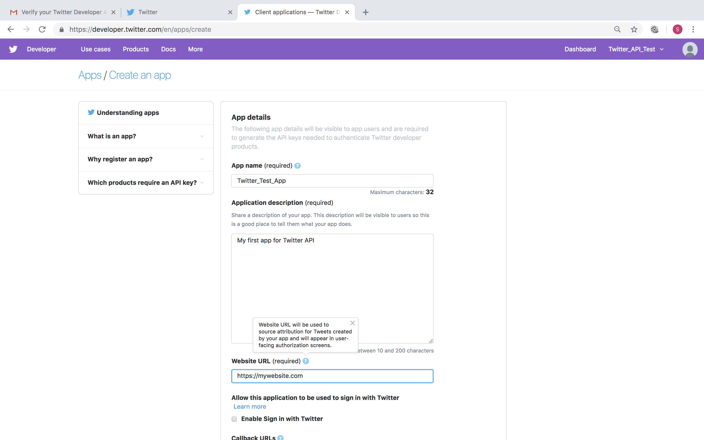
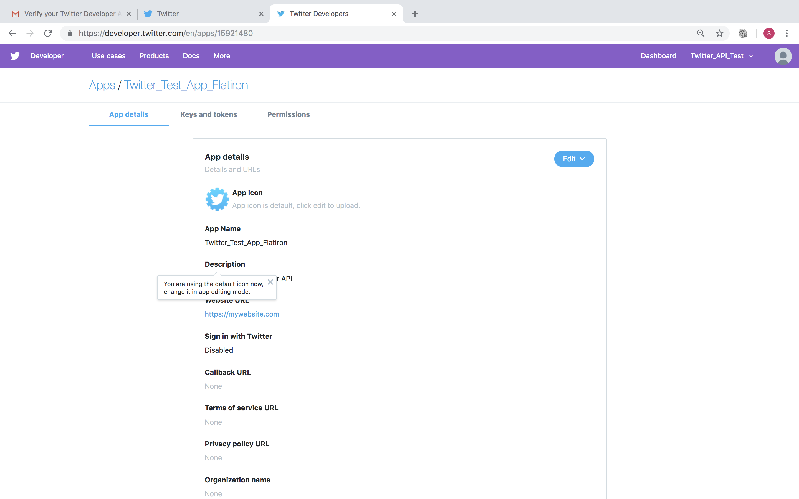
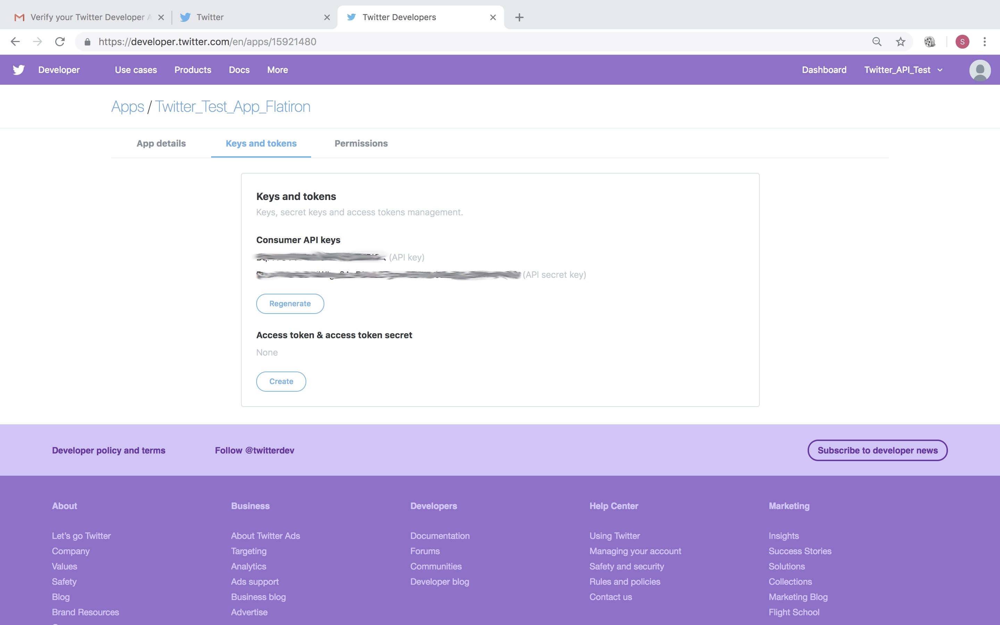
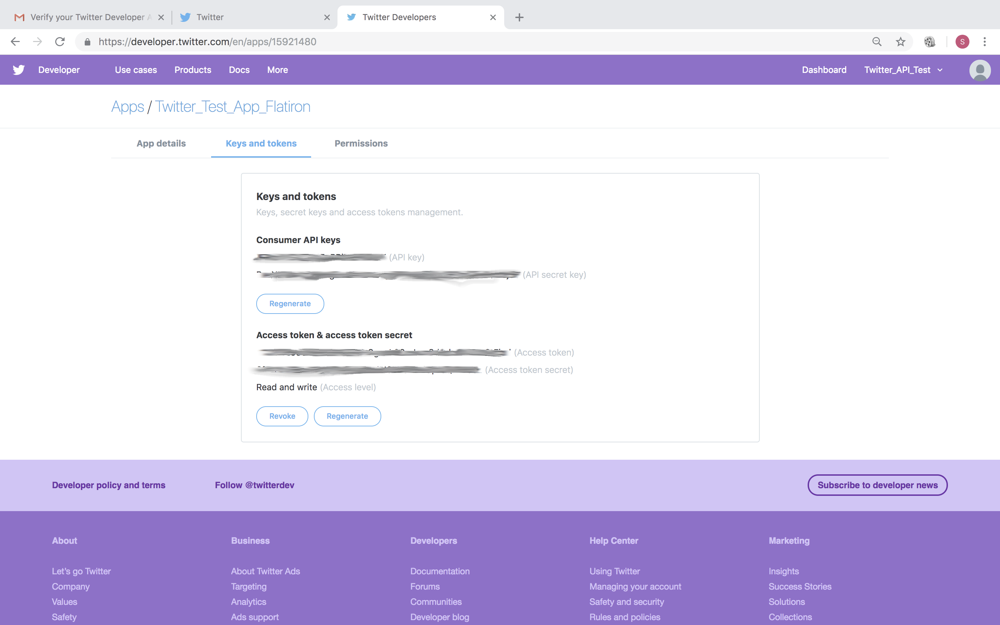

# Working With Twitter API - code along

## Introduction 

Now that we have covered the basics of API calling including how clients and servers communicate, what is API calling and how OAuth works, we can now move on to making API calls for more practical analytical scenarios to popular web services like Twitter, Facebook and Google etc. This code along styled lesson will show you how to create a Twitter web app and use credentials to sign up to Twitter API. 

## Objectives
You will be able to:
 
* Successfully sign up to use Twitter’s API

## Twitter API 

Twitter is a great source for mining of data as almost every Twitter user’s tweets are  public and retrievable. This allows great opportunities for data scientists trying to get a large amount of data to run analytical experiments on. Twitter data is also very concise and specific, which makes it very easy to process it in order to get some insights. Twitter’s API allows complex queries like pulling every tweet about a certain topic, specify time intervals to suit the focus of analysis or pull a certain user’s most retweeted tweets etc.

A use case for this exercise could be analyzing Twitter data to monitor the success of a  marketing campaign by collecting data to see how well our company is being received in the general public pre and post the campaign. We could collect tweets that mention our company and run an NLP based sentiment analysis algorithm to make informed management decision. 

Let's walk through the steps required to start using this API. You are advised to follow these steps with your own account. 

### Create a Twitter developer account

In order to have access to Twitter data programmatically, we have to create a developer account on the Twitter apps site.

Firstly we need to have a **verified** twitter account.  

#### Log in or make a Twitter developer account at https://apps.twitter.com/.

We now need to go to apps.twitter.com and create app so we can reference the coresponding keys Twitter generates for this app. These are the keys that we will use with our application to communicate with the Twitter API.

#### Fill in the app creation page with a unique name, a website name (use a placeholder website if you don’t have one), and a project description. Accept the terms and conditions and proceed to the next page.

### Create a New App
Fill in the app creation page with a unique name, a website name (use a placeholder website if you don’t have one), and a project description. 

#### Accept the terms and conditions and proceed to the next page.

After successfully registering the app, we can navigate to its main page which may look something similar to the screen shot below.

### Request Access Tokens and Secrets
We also need a pair of access tokens. 

#### Click on "Keys and Tokens" tab and request those tokens by clicking the "Create" button. 

You should now have an access token and access token secret. With the access tokens requested and granted, your page will now look like this: 

> **REMEMBER ..**

> **ALWAYS KEEP YOUR TOKENS AND SECRETS .. SECRET.**

### and that's it ..
The four strings (keys) above is all you need to start accessing Twitter from your python code. Store these key values and we shall start using these to access twitter in the following lab. Here are how to find these keys.

* **consumer_key**: Find this in your app page under the “Keys and Tokens”
* **consumer_secret**: Right under consumer_key in the “Keys and Tokens” tab
* **access_token_key**:  You will need to click the “create” button to get this
* **access_token_secret**: Available after “create” is pressed

## Summary
In this lesson, we saw how to create a Twitter developer account to allow Twitter API access. We saw how to create an app on Twitter and and get user and access tokens. In the next lab, we shall use these token to make some API calls to twitter and retrieve information. 
